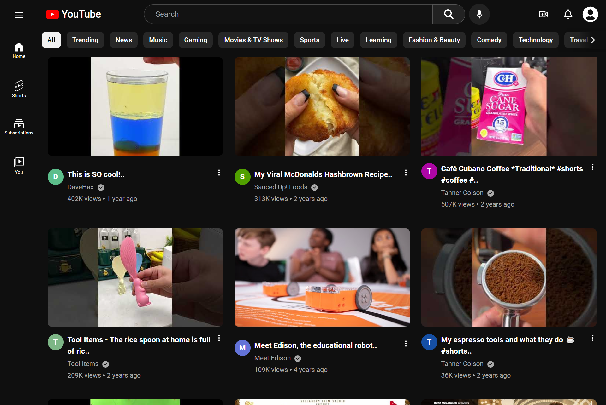
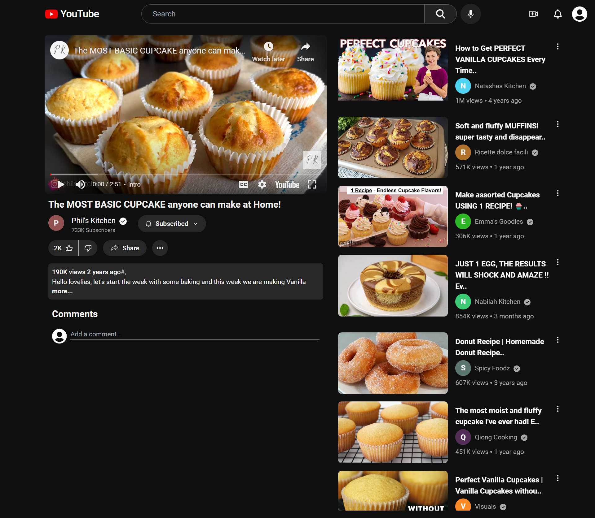
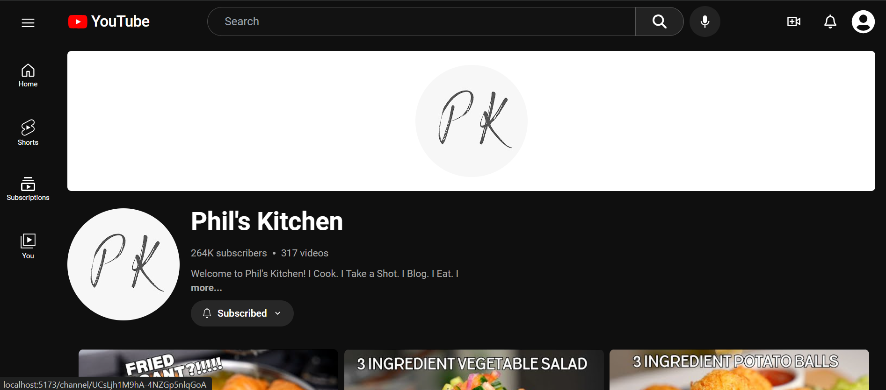
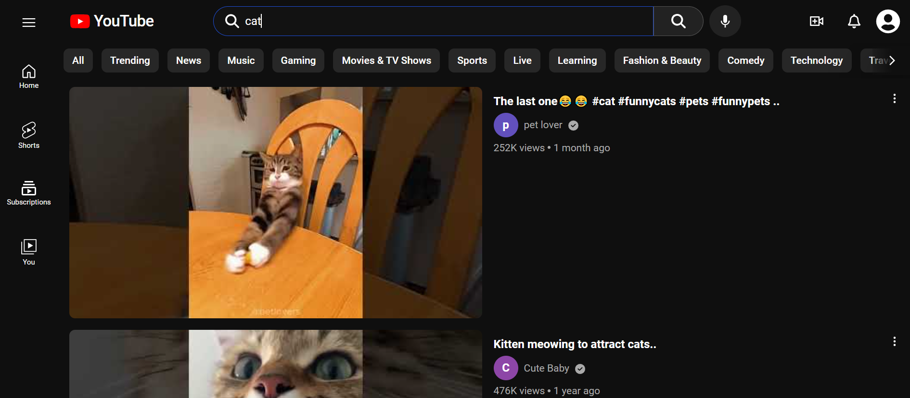
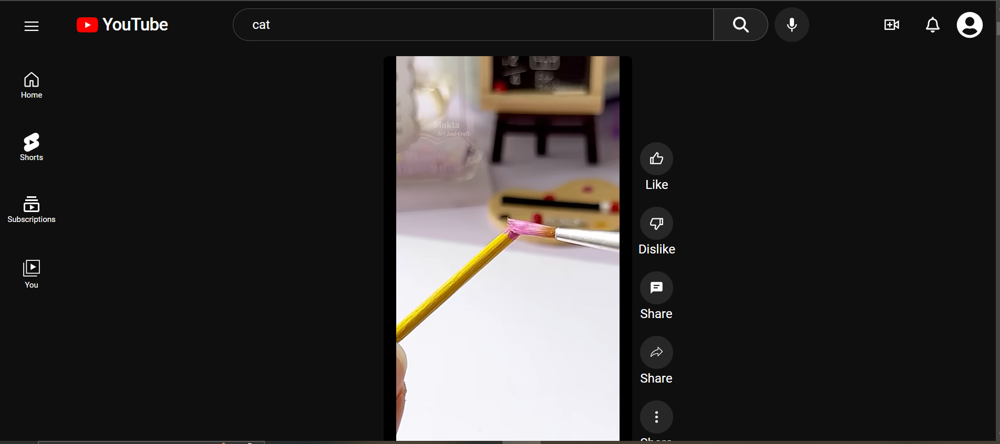
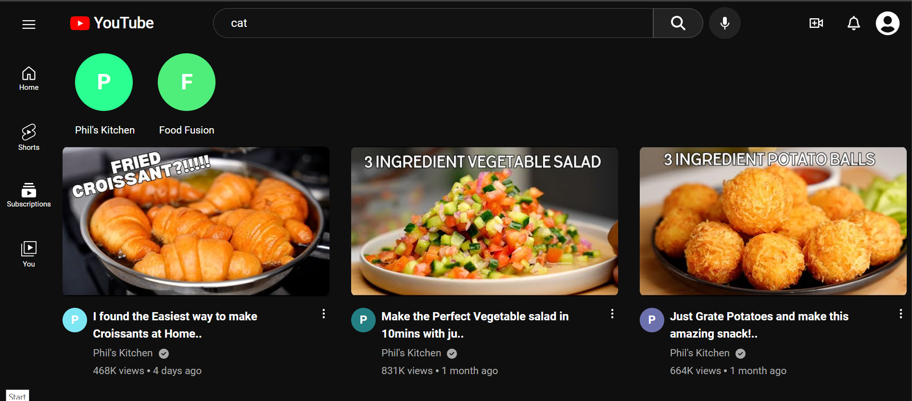
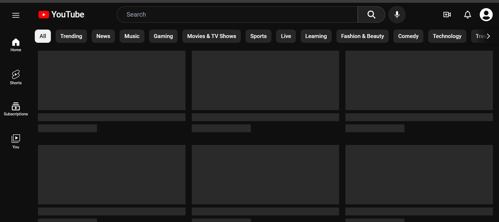

# YouTube Clone

## Overview

This project is a YouTube clone built using React and the YouTube Data API v3. It replicates key features of YouTube, including browsing videos, viewing video details, commenting, channel management, and subscriptions.

## Features

- **Home Page**: Browse videos by category.
- **Video Detail Page**: View video details and leave comments.
- **Channel Page**: Explore channel content and manage subscriptions.
- **Search Functionality**: Search for videos from the navigation bar.
- **Shorts Page**: Dedicated page for YouTube Shorts.
- **Subscription Page**: View and manage subscribed channels.

## Technologies Used

- **React**: Utilizes hooks, state management, and Context API.
- **React Router**: For client-side routing.
- **Local Storage**: For storing user data and preferences.
- **YouTube Data API v3**: Fetches video and channel data.

## Getting Started

1. **Clone the Repository**:
    ```bash
    git clone https://github.com/your-username/youtube-clone.git
    ```

2. **Navigate to the Project Directory**:
    ```bash
    cd youtube-clone
    ```

3. **Install Dependencies**:
    ```bash
    npm install
    ```

4. **Start the Development Server**:
    ```bash
    npm start
    ```


## Screenshots

- **Home Page**:
  
- **Video Detail Page**:
  
- **Channel Page**:
  
- **Search Functionality**:
  
- **Shorts Page**:
  
- **Subscription Page**:
  
- **Skeleton Loader**:
  

## Note

This is a personal practice project created to explore and showcase my skills in React and API integration. It is not intended for commercial use.


